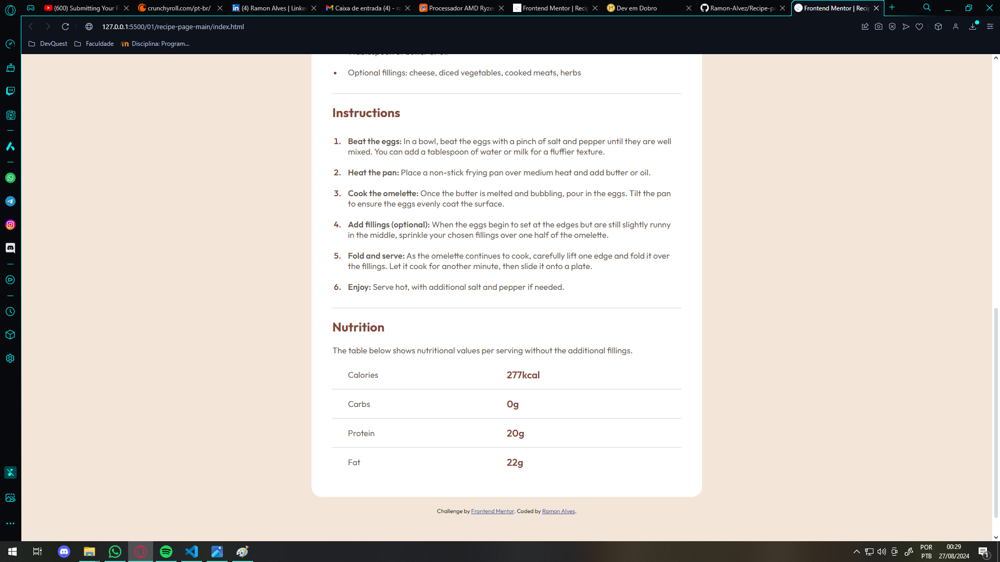
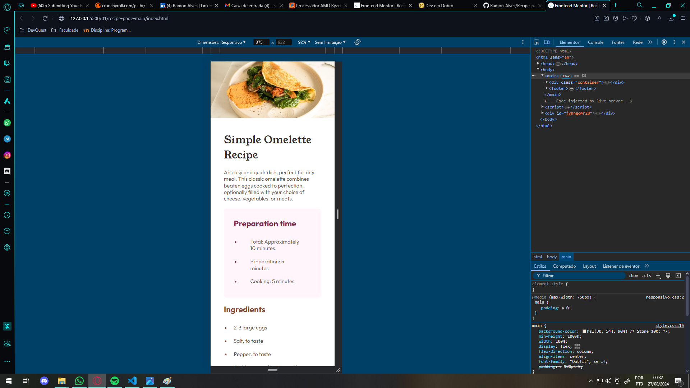
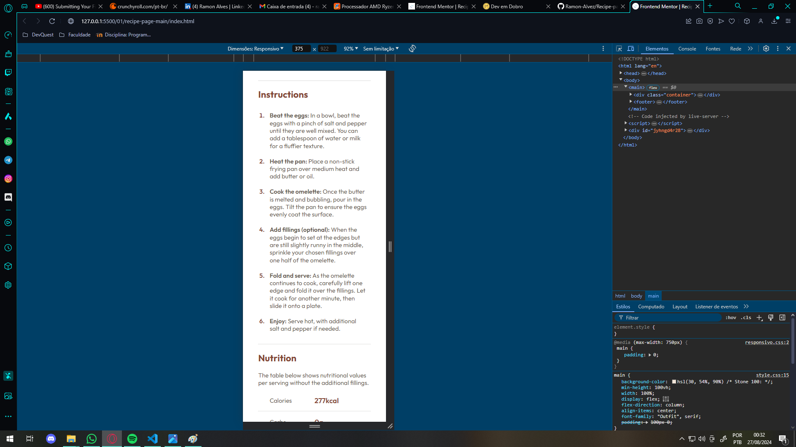
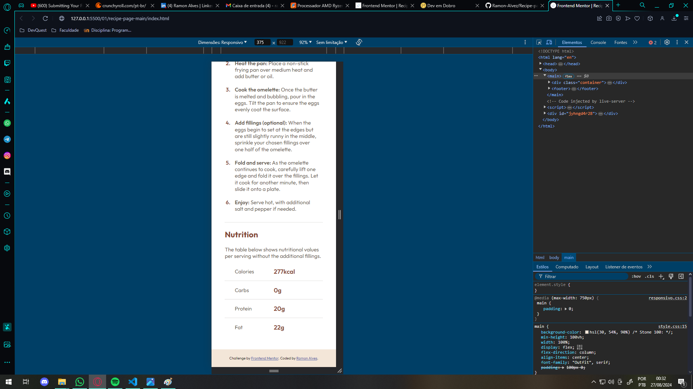

# Frontend Mentor | Solução Perfil de links sociais

Esta é uma solução para o [Recipe page challenge on Frontend Mentor](https://www.frontendmentor.io/challenges/recipe-page-KiTsR8QQKm). Os desafios do Frontend Mentor ajudam você a melhorar suas habilidades de codificação através da construção de projetos realistas.

## Conteúdo

- [Resumo](#resumo)
  - [O desafio](#o-desafio)
  - [Prints](#prints)
  - [Links](#links)
- [Meu processo de resolução](#meu-processo-de-resolução)
  - [Feito com](#feito-com)
  - [O que aprendi](#o-que-aprendi)
- [Autor](#autor)

## Resumo

Basicamente, este é um projeto de uma página de Receitas, onde a receita apresentada é uma simples omelete, este projeto conta com sessões de:
- Tempo de preparo;
- Ingredientes;
- Instruções;
- "Tabela" nutricional
Cada sessão com seu design e descrição modelados conforme proposto pelo desafio, utilizando as cores, fontes e tamanhos declaradas no style-guide.

Por ser um projeto simples (nível novato) e utilizar só HTML e CSS, não tive dificuldades em realizar esse desafio, gostei bastante de resolver ele.

  ~~ Tempo gasto: Aproximadamente 2 horas ~~

[Índice](#conteúdo) - Clique para voltar para o índice "Conteúdo"

### O desafio

O desafio é construir esta página de receitas e fazê-la parecer o mais próximo possível do design.

[Índice](#conteúdo) - Clique para voltar para o índice "Conteúdo"

### Prints

Aqui esta alguns prints da página

- Desktop

- Mobile

[Índice](#conteúdo) - Clique para voltar para o índice "Conteúdo"

### Links

- URL do FrontEnd Mentor: [FrontEnd Mentor](https://www.frontendmentor.io/solutions/resoluo---recipe-page-html5-e-css-1-newbie-AgDE6G9zud)
- URL do Site: [Live Site](https://ramon-alvez.github.io/Frontend-Mentor-HTML-CSS-Newbie-Recipe-page/)

[Índice](#conteúdo) - Clique para voltar para o índice "Conteúdo"

## Meu processo de resolução

- Primeiro eu estruturei o modelo HTML para deixar conforme a estrutura proposta pelo desafio, depois fui estilizando com o CSS; 

- No CSS eu quis deixar o mais parecido possível com a foto do design, para isso eu usei um display flex no main para poder centralizar o conteúdo do container tanto verticalmente quanto horizontalmente (pois eu vi que estava assim na foto);

- Eu utilizei bastante estilizações com tags globais pois não vi necessidade de criar uma classe específica para eles, caso exista algum feedback quanto a isso eu sou todo ouvidos;

- Eu criei uma div para cada seção de conteúdo, separando com nomes que eu julguei descritivos, tudo para deixar bem organizado e facil de dar manutenção;

- Eu decidi deixar a imagem com 100% de width para que ela seguisse responsiva em conformidade com o tamanho de tela, e para centralizar utilizei o padding;

- Na div Receita, eu utilizei um display flex só para poder criar um gap entre os elementos, assim eu não precisaria fazer esse espaçamento manualmente em cada div;

- Na div de Preparação eu percebi que o espaçamento entre o conteúdo e o tópico das listas era um pouco maior que o padrão utilizado em toda a página, por isso eu modifiquei o padding novamente (pois a estilização global de lista lá em cima não supria essa condição), mas acredito que não teve problema pois eu tentei fazer essa alteração de forma específica, e como os outros tópicos seguiam o mesmo padrão, a declaração global economizou um pouco de código;

- Por último na aba de Nutrição, para criar aquela descrição nutritiva eu pensei em fazer com uma tabela, e criaria um border-bottom para deixar a estilização parecida, mas depois de tentar eu vi que não seria muito legal, pensei em criar um parágrafo com um span separando os valores da descrição, logo vi que isso não daria muito certo. Por fim decidi fazer uma nova div e criar um display flex para separar a descrição dos valores e setei a largura em 50% da largura original, assim iria separar as partes igualmente, mas ainda assim a primeira tem uma margem esquerda um pouco maior, por isso o padding-left de 30px; 

- Após finalizar a estilização, fui mexer na responsividade, decidi criar o ponto de quebra em 760px pois na versão desktop ainda existe uma pequena margem separando o conteúdo do fundo creme, desta forma faz sentido deixar ele centralizado verticalmente, menor que 760 o conteúdo cobrindo a tela inteira acabou combinando mais com a proposta.

[Índice](#conteúdo) - Clique para voltar para o índice "Conteúdo"

### Feito com

- Marcação HTML5 semântica
- CSS 
- Flexbox

[Índice](#conteúdo) - Clique para voltar para o índice "Conteúdo"

### O que aprendi

Aprendi a desenvolver um projeto sozinho com base em um design fornecido por terceiros, este é o primeiro de muitos. Acredito que em breve os erros que foram cometidos aqui não irão se repetir nos próximos projetos!

[Índice](#conteúdo) - Clique para voltar para o índice "Conteúdo"

## Autor

- Github - [Ramon-Alvez](https://github.com/Ramon-Alvez)
- Frontend Mentor - [@Ramon-Alvez](https://www.frontendmentor.io/profile/Ramon-Alvez)
- LinkedIn - [@Ramon Alves](https://www.linkedin.com/in/ramon-alvez/)

** Nota: Meu nome do meio é Alves, Eu só uso o Z porque é legal =p (e porque o LinkedIn não deixa eu usar o Alves na minha url :/)

[Índice](#conteúdo) - Clique para voltar para o índice "Conteúdo"
