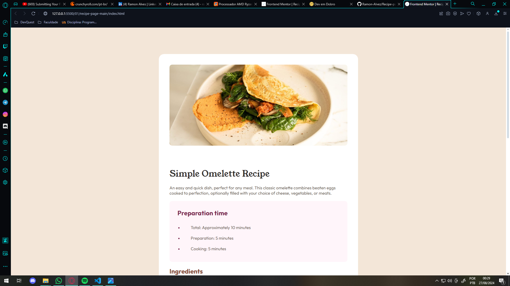
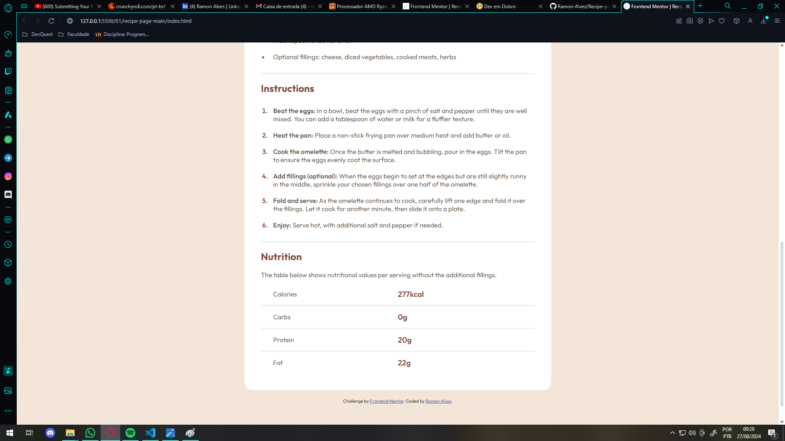

# Frontend Mentor - Recipe page solution

This is a solution to the [Recipe page challenge on Frontend Mentor](https://www.frontendmentor.io/challenges/recipe-page-KiTsR8QQKm). Frontend Mentor challenges help you improve your coding skills by building realistic projects. 

## Table of contents

- [Overview](#overview)
  - [The challenge](#the-challenge)
  - [Screenshots](#screenshots)
  - [Links](#links)
- [My process](#my-process)
  - [Built with](#built-with)
  - [What I learned](#what-i-learned)
- [Author](#author)

## Overview

Basically, this is a one-page Recipes project, where the recipe presented is a simple omelette, this project has sessions of:
- Preparation time;
- Ingredients;
- Instructions;
- Nutritional "table"
Each session with its design and description modeled as proposed by the challenge, using the colors, fonts and sizes declared in the style-guide.

As it is a simple project (beginner level) and uses only HTML and CSS, I had no difficulty in completing this challenge, I really enjoyed solving it.

  ~~ Time spent: About 2 hours ~~

[Table of contents](#table-of-contents) - Click to return to the index "Table of contents"

### The challenge

The challenge is to build out this recipe page and get it looking as close to the design as possible.

[Table of contents](#table-of-contents) - Click to return to the index "Table of contents"

### Screenshots

Here some pics of the solution

- Desktop

- Mobile

[Table of contents](#table-of-contents) - Click to return to the index "Table of contents"

### Links

- Solution URL: [FrontEnd Mentor](https://www.frontendmentor.io/solutions/resoluo---recipe-page-html5-e-css-1-newbie-AgDE6G9zud)
- Live Site URL: [Live Site](https://ramon-alvez.github.io/Frontend-Mentor-HTML-CSS-Newbie-Recipe-page/)

[Table of contents](#table-of-contents) - Click to return to the index "Table of contents"

## My process

- First I structured the HTML model to conform to the structure proposed by the challenge, then I styled it with CSS; 

- In the CSS I wanted to make it as similar as possible to the design photo, for this I used a flex display in the main to be able to center the content of the container both vertically and horizontally (as I saw that it was like that in the photo);

- I used a lot of styling with global tags because I didn't see the need to create a specific class for them, if there is any feedback on this I'm all ears;

- I created a div for each content section, separating it with names that I considered descriptive, everything to make it well organized and easy to maintain;

- I decided to leave the image at 100% width so that it remained responsive in accordance with the screen size, and to center it I used padding;

- In the Recipe div, I used a flex display just to be able to create a gap between the elements, so I wouldn't need to do this spacing manually in each div;

- In the Preparation div I noticed that the spacing between the content and the topic of the lists was a little larger than the standard used throughout the page, so I modified the padding again (as the global list styling up there did not provide this condition), but I believe there was no problem because I tried to make this change specifically, and as the other topics followed the same pattern, the global declaration saved a little code;

- Lastly, on the Nutrition tab, to create that nutritional description I thought about doing it with a table, and I would create a border-bottom to make the stylization similar, but after trying I saw that it wouldn't be very cool, I thought about creating a paragraph with a span separating the values ​​from the description, I soon saw that this wouldn't work very well. Finally I decided to make a new div and create a flex display to separate the description from the values ​​and I set the width to 50% of the original width, this way it would separate the parts equally, but still the first one has a slightly larger left margin, so this is padding-left of 30px; 

- After finishing the styling, I changed the responsiveness, I decided to create the breakpoint at 760px because in the desktop version there is still a small margin separating the content from the cream background, so it makes sense to leave it centered vertically, less than 760 the content covering the entire screen ended up matching the proposal better.

[Table of contents](#table-of-contents) - Click to return to the index "Table of contents"

### Built with

- Semantic HTML5 markup
- CSS custom properties
- Flexbox

[Table of contents](#table-of-contents) - Click to return to the index "Table of contents"

### What I learned

I learned how to develop a project myself based on a design provided by others, this is the first of many. I believe that soon the mistakes that were made here will not be repeated in future projects!

[Table of contents](#table-of-contents) - Click to return to the index "Table of contents"

## Author

- Github - [Ramon-Alvez](https://github.com/Ramon-Alvez)
- Frontend Mentor - [@Ramon-Alvez](https://www.frontendmentor.io/profile/Ramon-Alvez)
- LinkedIn - [@Ramon Alves](https://www.linkedin.com/in/ramon-alves-z/)

** Note: My middle name is Alves, I just use the Z because its stylish =p (and LinkedIn dont allow me to use alves in my url :/)

[Table of contents](#table-of-contents) - Click to return to the index "Table of contents"
